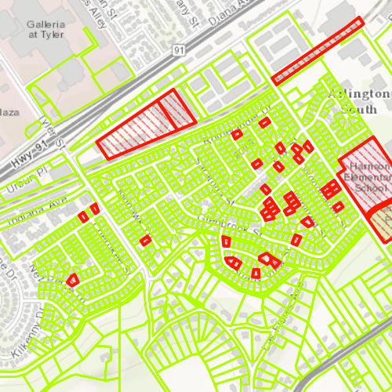

#Service feature table - no cache

This sample demonstrates how to use a feature table with the FeatureRequestModeOnInteractionNoCache feature request mode. This mode will not cache any features locally from the remote feature service. This means that new features are requested from the service upon each extent change on the map.

##How it works

The sample creates an instance of ServiceFeatureTable by supplying the URL to the REST endpoint of the feature service. The FeatureRequestModeOnInteractionNoCache feature request mode is set 
on the ServiceFeatureTable as well. The FeatureLayer is then supplied with the ServiceFeatureTable and added to the map.

##Features
- MapView
- Map
- Basemap
- ServiceFeatureTable
- FeatureLayer
