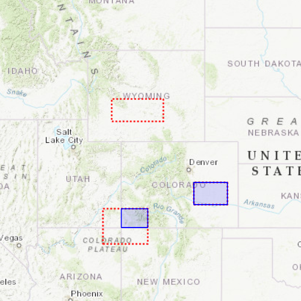

# Clip geometry

Clip a geometry with another geometry.

## Use case

Create a new set of geometries for analysis (e.g. displaying buffer zones around abandoned coal mine shafts in an area of planned urban development) by clipping intersecting geometries.

## How to use the sample

Click the "Clip" button to clip the blue graphic with the red dashed envelopes.

## How it works
1. Create a `GraphicsOverlay` and add a `Graphic` containing an envelope.
2. Create another `GraphicsOverlay` that contains three other envelopes: one that intersects a part of the first graphic, one that is entirely within it, and another completely outside of it.
3. Create a third `GraphicsOverlay` but add no graphics to it.
4. Create a Button that, when clicked, calls a function that hides the main graphic. In the same function, iterate through the `GraphicsOverlay` that contains the three envelopes and call `GeometryEngine.clip` for each `Envelope`, by passing in the main graphic's `Geometry` and the current `Envelope` as arguments.
5. Add each clipped `Geometry` graphic to the empty `GraphicsOverlay` to visualize the clipped geometries.

## Relevant API

* Envelope
* Geometry
* GeometryEngine.clip
* Graphic
* GraphicsOverlay

## Additional information

Note: the resulting geometry may be null if the envelope does not intersect the geometry being clipped.

## Tags

analysis, clip, geometry

