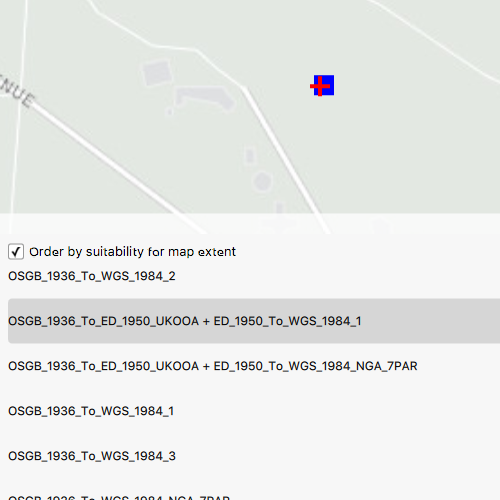

# List transformations

This sample demonstrates how to use the TransformationCatalog to get a list of available DatumTransformations that can be used to project a Geometry between two different SpatialReferences, and how to use one of the transformations to perform the GeometryEngine.project operation.

## How it works

## Features

