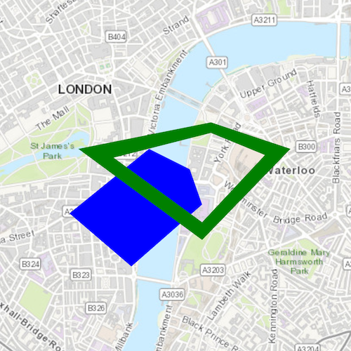

# Spatial operations

This sample demonstrates how to perform spatial operations on geometries using the GeometryEngine. Spatial operations allow you to perform spatial analysis between two geometries. For example, you can union (combine) two geometries together or find the areas of two geometries that intersect. For example, if you had a polygon representing rivers and another polygon representing counties, you could find the rivers that intersect a given county.

## How to use the sample
The sample provides an option to select a geometry operation. When you choose a geometry operation, the application performs this operation between the overlapping polygons and applies the result to the geometries.

## How it works
The sample creates two overlapping polygons using the `PolygonBuilder` class and adds them as graphics to a `GraphicsOverlay`. These polygons are used for performing all the spatial operations. For each operation, a method on the `GeometryEngine` is called with the two polygons as input. The resulting geometry is added as a red colored graphic to the overlay. The methods used are as follows:

- `GeometryEngine::union` - This method returns the two geometries unioned together as one geometry.
- `GeometryEngine::difference` - This method returns any part of Geometry2 that does not intersect Geometry1.
- `GeometryEngine::symmetricDifference` - This method returns any part of Geometry1 or Geometry2 which do not intersect.
- `GeometryEngine::intersection` - This method returns the intersection of Geometry1 and Geometry2.

## Relevant API
- GeometryEngine
- GeometryEngine::union
- GeometryEngine::difference
- GeometryEngine::symmetricDifference
- GeometryEngine::intersection
- Geometry
- Graphic
- GraphicsOverlay
- PolygonBuilder

## Tags
Geometry Engine, Spatial Operations, Geometry, Analysis
