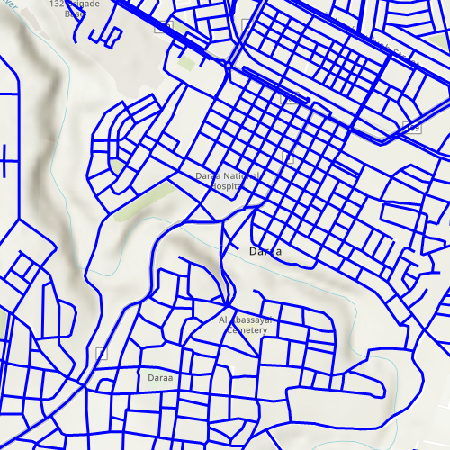

# Display OGC API Feature Collection

This sample demonstrates how to display an OGC API feature collection and query features while navigating the map view.

## Use case

When panning the map view, it is necessary to query the OGC API feature table to obtain additional features within the new visible extent.

## How to use the sample

Pan the map and observe how new features are loaded from the OGC API feature service.

## How it works

1. Create an `OgcFeatureCollectionTable` object using a URL to an OGC API feature service and a collection ID.
2. Set the feature table's `featureRequestMode` to `Enums.FeatureRequestModeManualCache` so features requested from the server are cached locally.
3. Create a `FeatureLayer` using the feature table and add it to the Map.
4. Create a `QueryParameters` object with the following parameters:

    i. Set the `geometry` to the current extent of the map view.

    ii. Set the `SpatialRelationship` to `Enums.SpatialRelationshipIntersects`.

    iii. Set the `MaxFeatures` property to 5000 (some services have a low default value for maximum features).
5. When the feature table loads and thereafter every time time the map view navigation completes, call `OgcFeatureCollectionTable.populateFromService()` using the query parameters from the previous steps.

## Relevant API
* OgcFeatureCollectionTable
* QueryParameters

## Additional information

See the [OGC API website](https://ogcapi.ogc.org/) for more information on the OGC API family of standards.

## Tags

feature, feature layer, feature table, OGC, OGC API, service, table, web
