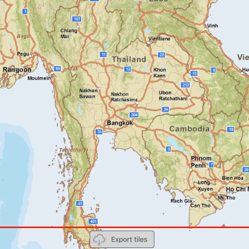

# Export tiles

Download tiles to a local tile cache file stored on the device.

## Use case

Field workers with limited network connectivity can use exported tiles as a basemap for use offline.

## How to use the sample

Pan and zoom into the desired area, making sure the area is within the red boundary. Click the 'Export tiles' button to start the process. On successful completion you will see a preview of the downloaded tile package.

## How it works

1. Create and load a Map with a basemap style that includes a raster base layer.
2. Create an `ExportTileCacheTask` with a URL from a raster base layer of a basemap.
3. Create default `ExportTileCacheParameters` for the task, specifying extent, minimum scale and maximum scale. Limiting the difference between the minimum and maximum scales will decrease the size of the resulting tile package and the time it takes to create.
4. Use the parameters and a path to create an `ExportTileCacheJob` from the task.
5. Start the job, and when it completes successfully, get the resulting `TileCache`.
6. Use the tile cache to create an `ArcGISTiledLayer`, and display it in the map.

## Relevant API

* ArcGISTiledLayer
* ExportTileCacheJob
* ExportTileCacheParameters
* ExportTileCacheTask
* TileCache

## Additional information

ArcGIS tiled layers do not support reprojection, query, select, identify, or editing. See the [Layer types](https://developers.arcgis.com/qt/layers/#layer-types) discussion in the developers guide to learn more about the characteristics of ArcGIS tiled layers.

## Tags

cache, download, offline
