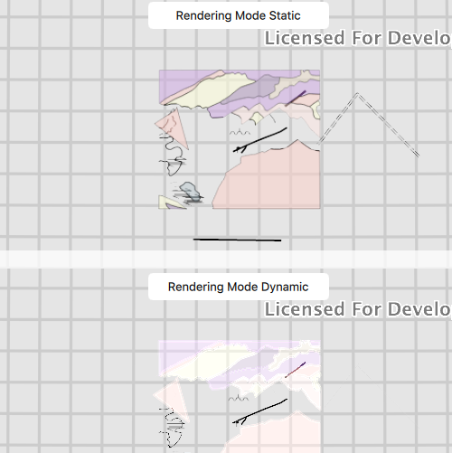

# Feature layer rendering mode (map)

This sample demonstrates the differences between static and dynamic rendering mode for a FeatureLayer in a Map.

## How it works
Two `Maps` are created, each containing several `FeatureLayers`. Prior to loading each `Map`, several `LoadSettings` are set: `preferredPointFeatureRenderingMode`, `preferredPolygonFeatureRenderingMode`, and `preferredPolylineFeatureRenderingMode`. One `Map` explicitly sets the rendering mode to be `Static` while the other sets the rendering mode to be `Dynamic`. The rendering mode can change the behavior and performance of the `FeatureLayer` depending on several factors with the underlying data. This sample animates the `MapView` viewpoint between two viewpoints, which helps display the differences between the two modes.

## Features
- FeatureLayer
- LoadSettings
- ServiceFeatureTable
- MapView
- Map
- Viewpoint
