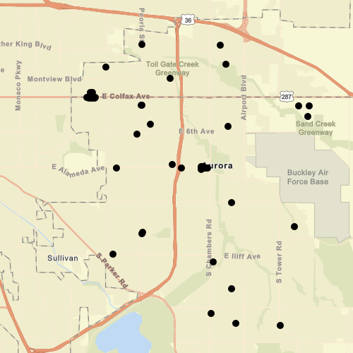

# Feature layer (shapefile)

This sample demonstrates how to open a shapefile stored on the device and display it as a feature layer with default symbology. The shapefile will be downloaded from an ArcGIS Online portal automatically.

## How it works
A ShapefileFeatureTable is created using the path to a shapefile (.shp) on the file system. The ShapefileFeatureTable is then used to create a FeatureLayer. The FeatureLayer is added to the map as an operational layer, using default symbology and rendering.

## Features
- ShapefileFeatureTable
- FeatureLayer

