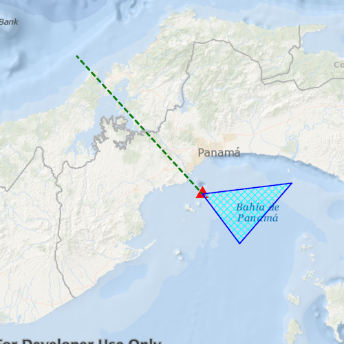

# Feature collection layer

Create a Feature Collection Layer from a Feature Collection Table, and add it to a map.

## Use case

A Feature Collection allows easily importing external data (such as CSV files), as well as creating custom schema for data that is in non-standardized format. This data can then be used to populate a Feature Collection Table, and displayed in a Feature Collection Layer using the attributes and geometries provided in the external data source. For example, an electricity supplier could use this functionality to visualize existing location data of coverage areas (polygons), power stations (points), transmission lines (polylines), and others.

## How to use the sample

When launched, this sample displays a `FeatureCollectionLayer` with a `Point`, `Polyline` and `Polygon` geometry. Pan and zoom to explore the scene.

## How it works

A `FeatureCollectionLayer` is created from a `FeatureCollection` and is added to the map's operational layers. Then, a point `FeatureCollectionTable`, a polyline `FeatureCollectionTable`, and a polygon `FeatureCollectionTable` are created, and their schemas and renderers are defined. Next, features are added to each table, and each table is added to the FeatureCollection. In this case, hardcoded features are added to the tables for display on the map. However, a common use case is to read a CSV or some other data source, and to popuplate the table with the attributes and geometry provided in the external data source.
1. Create a `FeatureCollectionLayer` using a new feature collection,.
2. Add the feature collection layer to the `Map`.
3. Create a `FeatureCollectionTable` for the `GeometryType`s `Point`, `Polyline`, and `Polygon`, `FeatureCollectionTable(fields, geometryType, spatialRefernce)`
    *  Additionally, pass in a list of `Field` objects to represent the table's schema. In this case a field of type String named `name` is added.
4. Assign a `SimpleRenderer` to each table to render any `Feature`s from that table using the `Symbol` that was set.
5. Add the feature collection table to the feature collection, `FeatureCollection.tables.addFeature(featureCollectionTable)`.
6. Use the `createFeature` method to create a feature from the feature collection table, passing an attribute and geometry for that feature, `FeatureCollectionTable.createFeature(attributes, geometry)`.
7. Add new features to the table, `FeatureCollectionTable.addFeature(feature)`.

## Relevant API

* Feature
* FeatureCollection
* FeatureCollectionLayer
* FeatureCollectionTable
* Field
* SimpleRenderer

## Tags

collection, feature, layers, table
