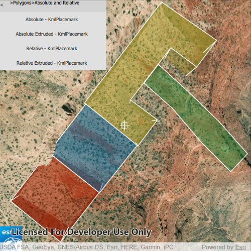

# List KML contents

List the contents of a KML file.

## Use case

KML files can contain a hierarchy of features, including network links to other KML content. A user may wish to traverse through the contents of KML nodes to know what data is contained within each node and, recursively, their children.

## How to use the sample

The contents of the KML file are shown in a list of buttons. Select a node to zoom to that node and see its child nodes, if it has any. Not all nodes can be zoomed to (e.g. screen overlays).

## How it works

1. Add the KML file to the scene as a layer.
2. Explore the root nodes of the `KmlDataset` recursively to create a view model.
  * Each node is enabled for display at this step. KML files may include nodes that are turned off by default.
3. When a node is selected, use the node's `Extent` to determine a viewpoint and set the `SceneView` object's viewpoint to it.

## Relevant API

* KmlDataset
* KmlDocument
* KmlFolder
* KmlGroundOverlay
* KmlLayer
* KmlNode
* KmlPlacemark
* KmlScreenOverlay

## Offline data

Read more about how to set up the sample's offline data [here](http://links.esri.com/ArcGISRuntimeQtSamples).

Link | Local Location
---------|-------|
|[ESRI test data](https://www.arcgis.com/home/item.html?id=da301cb122874d5497f8a8f6c81eb36e)| `<userhome>`/ArcGIS/Runtime/Data/kml/esri_test_data.kmz |

## About the data

This is an example KML file meant to demonstrate how Runtime supports several common features.

## Tags

Keyhole, KML, KMZ, layers, OGC

