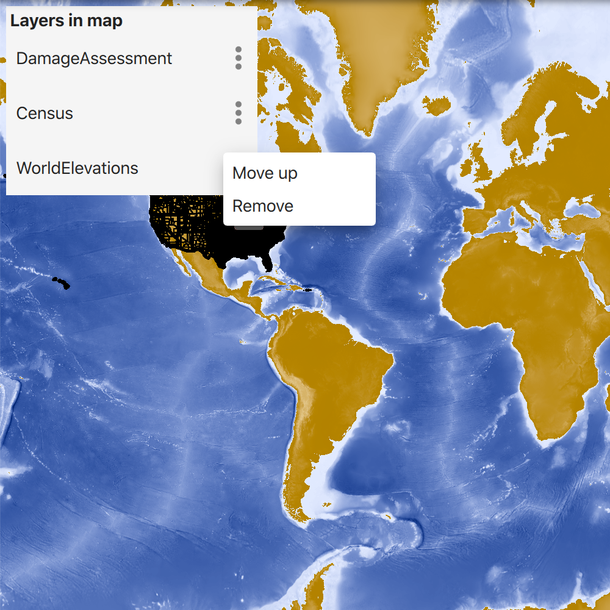

# Manage operational layers

Add, remove, and reorder operational layers in a map.

## Use case

Operational layers display the primary content of the map and usually provide dynamic content for the user to interact with (as opposed to basemap layers that provide context).

The order of operational layers in a map determines the visual hierarchy of layers in the view. You can bring attention to a specific layer by rendering above other layers.

## How to use the sample

When the app starts, a list displays the operational layers that are currently displayed in the map. Select the menu option on the list item to remove or reorder the layer. The map will be updated automatically.

The second list shows layers that have been removed from the map. Select the menu option on the list item to add it to the map.

## How it works

1. Get the operational layers `LayerListModel` from the map using `map.operationalLayers`.
2. Subclass `QSortFilterProxyModel` so that the order in the view can be reversed. This is important when creating a table of contents so that the first layer in the map draws at the bottom of the list and the last layer in the map (which will render at the top) will draw on the top of the list.
3. Set the `LayerListModel` as the source model on you sort proxy model.
4. Create a QML `ListView` and set the model property to the reversed sort proxy model.
5. Create a delegate that displays the layer name and a QML menu which provides options to add, remove, and reorder the layer.
6. Add or remove layers using `operationalLayers.append(layer)` and `operationalLayers.remove(layer)` respectively.
7. Move layers using `operationalLayers.move(from, to)`.

## Relevant API

* ArcGISMapImageLayer
* LayerListModel
* LayerListModel.append
* LayerListModel.move
* LayerListModel.remove
* Map

## Tags

add, delete, layer, map, remove
