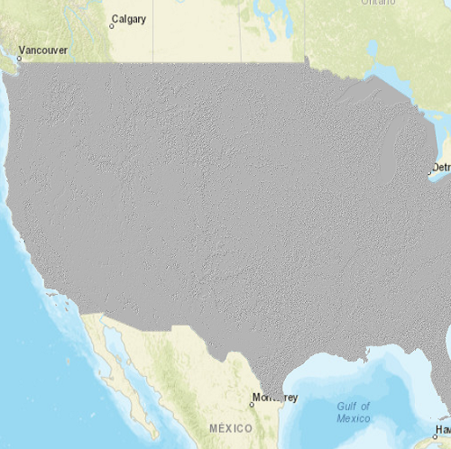

# Raster function (service)

This sample demonstrates how to create an `ImageServiceRaster` and apply a `RasterFunction` to it.  The `RasterFunction` applied in this case is `Hillshade`.

## How it works
When the sample starts, an `ImageServiceRaster` is created and added to a `RasterLayer`.  The `RasterLayer` is then added to the map as an operational layer.  Upon clicking the button, a `RasterFunction` (Hillshade) is created using the JSON specified in a local JSON file. The `ImageServiceRaster` is set as the raster for the `RasterFunctionArguments`.  A new `Raster` is created with the `RasterFunction` and added to the raster layer.

## Features
- `Map`
- `MapQuickView`
- `ImageServiceRaster`
- `RasterFunction`
- `RasterFunctionArguments`
- `RasterLayer`
