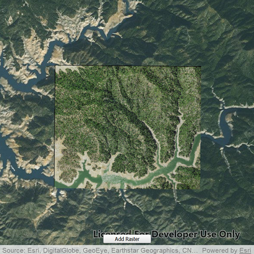

# Raster layer (file)

Create and use a raster layer made from a local raster file.

## Use case

Rasters can be digital aerial photographs, imagery from satellites, digital pictures, or even scanned maps. An end-user will frequently need to import raster files acquired through various data-collection methods into their map to view and analyze the data.

## How to use the sample

The sample will load with a map showing a basemap and a loaded raster layer. Tap on "Add Raster" to browse for a new raster file. On desktop platforms the sample also allows you to drag and drop supported raster files to load.

## How it works

To add a `RasterLayer` as an operational layer from a local raster file:

1. Create a `Map` with a `Basemap`. Once this has been loaded, raster layers will be re-projected on the fly to match the map.
2. Create a `Raster` from a raster file.
3. Create a `RasterLayer` from the raster.
4. Add it as an operational layer with `map.operationalLayers.append(rasterLayer)`.

## Relevant API

* Raster
* RasterLayer

## Offline Data
Read more about how to set up the sample's offline data [here](http://links.esri.com/ArcGISRuntimeQtSamples).

Link | Local Location
---------|-------|
|[Shasta.tif raster](https://www.arcgis.com/home/item.html?id=c669445e6cb4490b8306f0c170a9cbb1)| `<userhome>`/ArcGIS/Runtime/Data/raster/Shasta.tif

## Additional information

See the topic [What is raster data?](http://desktop.arcgis.com/en/arcmap/10.3/manage-data/raster-and-images/what-is-raster-data.htm) in the *ArcMap* documentation for more information about raster images.

## Tags

data, image, import, layer, raster, visualization
