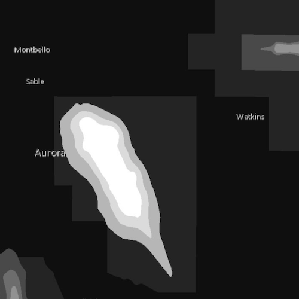

# Raster layer (GeoPackage)

Display a raster contained in a GeoPackage.

## Use case

GeoPackages are designed to simplify file management and transfer. They can store raster files (as well as other types of data). An end-user wishing to transfer rasters from ArcGIS Pro or between runtime apps, might need to import raster files from GeoPackages into their map to view and analyze the data.

## How to use the sample

When the sample starts, a raster will be loaded from a GeoPackage and displayed in the map view.

## How it works

1. Create and load a `GeoPackage`, specifying the path to the local .gpkg file.
2. When it is done loading, get the `GeoPackageRaster`s from the geopackage.
3. Construct a `RasterLayer` with the geopackage raster you want to use.
4. Add the raster layer to the map.

## Relevant API

* GeoPackage
* GeoPackageRaster
* RasterLayer

## Offline Data

Read more about how to set up the sample's offline data [here](http://links.esri.com/ArcGISRuntimeQtSamples).

Link | Local Location
---------|-------|
|[Aurora, Colorado GeoPackage](https://www.arcgis.com/home/item.html?id=68ec42517cdd439e81b036210483e8e7)| `<userhome>`/ArcGIS/Runtime/Data/gpkg/AuroraCO.gpkg |

## About the data

The [Aurora Colorado GeoPackage](https://www.arcgis.com/home/item.html?id=68ec42517cdd439e81b036210483e8e7) holds datasets that cover Aurora, Colorado. The raster that is opened and displayed shows airport noise levels.

## Tags

container, data, image, import, layer, OGC, package, raster, visualization
