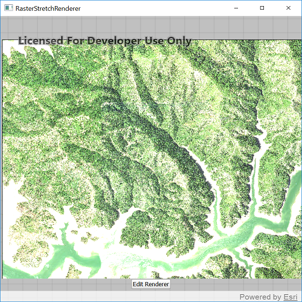

# Stretch renderer

Use a stretch renderer to enhance the visual contrast of raster data for analysis.

## Use case

An appropriate stretch renderer can enhance the contrast of raster imagery, allowing the user to control how their data is displayed for efficient imagery analysis.

## How to use the sample

Choose one of the stretch parameter types:

* Standard deviation - a linear stretch defined by the standard deviation of the pixel values
* Min-max - a linear stretch based on minimum and maximum pixel values
* Percent clip - a linear stretch between the defined percent clip minimum and percent clip maximum pixel values

Then configure the parameters and click 'Edit renderer'.

## How it works

To apply a `StretchRenderer` to a `RasterLayer`:

1. Create a `Raster` from a raster file.
2. Create a `RasterLayer` from the raster.
3. Create a `Basemap` from the raster layer and set it to the map.
4. Create a `StretchRenderer`, specifying the `StretchParameters` and other properties.
5. Set the renderer on the raster layer with `rasterLayer.renderer = renderer`.

## Relevant API

* ColorRamp
* MinMaxStretchParameters
* PercentClipStretchParameters
* Raster
* RasterLayer
* StandardDeviationStretchParameters
* StretchParameters

## Offline Data
Read more about how to set up the sample's offline data [here](http://links.esri.com/ArcGISRuntimeQtSamples).

Link | Local Location
---------|-------|
|[Shasta.tif raster](https://www.arcgis.com/home/item.html?id=c669445e6cb4490b8306f0c170a9cbb1)| `<userhome>`/ArcGIS/Runtime/Data/raster/Shasta.tif |

## About the data

This sample uses a raster imagery tile of an area of forested mountainous terrain and rivers.

## Additional information

See [Stretch function](http://desktop.arcgis.com/en/arcmap/latest/manage-data/raster-and-images/stretch-function.htm) in the *ArcMap* documentation for more information about the types of stretches that can be performed.

## Tags

analysis, deviation, histogram, imagery, interpretation, min-max, percent clip, pixel, raster, stretch, symbology, visualization
