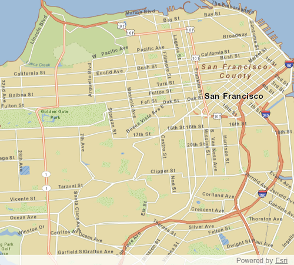

# ArcGIS tiled layer (tile cache)

Load an offline copy of a tiled map service as a basemap.

## Use case
Creating an `ArcGISTiledLayer` from a local tile package (.tpk & .tpkx) allows you to use that basemap tiled service when the application is offline. Dividing a raster into tiles allows the map to provide relevant tiles and level of detail to the user when panning and zooming. For example, when working in an environment that has no connectivity, this could provide access to a map for navigating your surroundings.

## How to use the sample

Launch the app to view the "San Francisco offline tile package" as the basemap.

## How it works

1. Create a `TileCache`, specifying the path to the local tile package.
2. Create an `ArcGISTiledLayer` with the tile cache.
3. Create a `Basemap` with the tiled layer.
4. Create a `Map` with the basemap and set it to a MapView.

## Relevant API

 * ArcGISTiledLayer
 * Basemap
 * Map
 * TileCache

## Offline data

Read more about how to set up the sample's offline data [here](http://links.esri.com/ArcGISRuntimeQtSamples#use-offline-data-in-the-samples).

Link | Local Location
---------|-------|
|[San Francisco Streets TPK](https://www.arcgis.com/home/item.html?id=3f1bbf0ec70b409a975f5c91f363fe7d)| `<userhome>`/ArcGIS/Runtime/Data/tpk/SanFrancisco.tpk |

## About the data

The map opens to a view of the city of San Francisco, CA. In a disconnected environment, this basemap tile service would be fully accessible to zoom and pan as if you were connected to a online service.

## Additional information

`ArcGISTiledLayer` and `TileCache` supports both .tpk and .tpkx file formats.

## Tags

cache, layers, offline, tile
