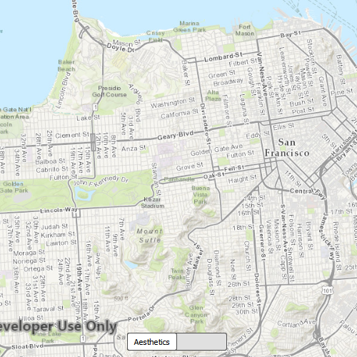

#TiledLayerRenderMode

This sample demonstrates how to change the renderMode for an `ArcGISTiledLayer`. You can choose between the SCALE and the AESTHETIC modes.

##How it works
The renderMode property of `ArcGISTiledLayer` can be set to one of the `RenderMode` enumerated values. SCALE always renders the layer at the correct scale which can result in a fuzzy effect on high DPI screens; AESTHETIC aims to ensure the layer draws clearly which will result in the map scale not being respected.

##Features
- MapView
- Map
- Basemap
- ArcGISTiledLayer
- RenderMode
- Viewpoint
- Point
- SpatialReference