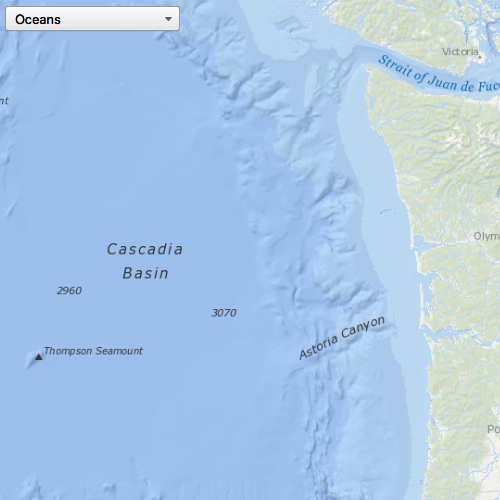

# Change basemap

Change a map's basemap. A basemap is beneath all layers on a `Map` and is used to provide visual reference for the operational layers.

## Use case

Basemaps should be selected contextually, for example, in maritime applications, it would be more appropriate to use a basemap of the world's oceans as opposed to a basemap of the world's streets.

## How to use the sample

Press the **Change Basemap** button to display the Basemap Gallery. When the gallery appears, select a basemap to be displayed.

## How it works

A basemap can be changed by setting the basemap property of a map object to a new basemap object (e.g. `map.basemap = basemap`). However, this sample utilises the `BasemapGallery` toolkit component to manage this process and provide a common user experience. In this sample, the `BasemapGallery` creates a visual display of basemap options and automates the changing of the basemap.

1. Create a `Map`.
2. Set the map to the `MapView`.
3. Create a `BasemapGallery` from the toolkit.
4. Assign the map to the `geoModel` property of the `BasemapGallery`.

## Relevant API

* Enums.BasemapStyle
* Map
* MapView

## Additional information

This sample uses the `BasemapGallery` toolkit component and requires the [toolkit](https://github.com/Esri/arcgis-maps-sdk-toolkit-qt) to be cloned and set-up locally. For information about setting up the toolkit, see the repository's root [README file](https://github.com/Esri/arcgis-maps-sdk-toolkit-qt/blob/main/uitools/README.md).

## Tags

basemap, map
