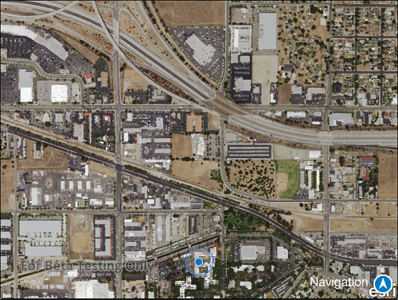

# Display device location

This sample demonstrates how you can enable Location Display to display your current position on the map, as well as switch between different types of AutoPan Modes.

## How it works

This sample starts with the Map with an imagery basemap loaded in the MapView and the position display turned on. When you tap on the image icon it gives you the list of possible AutoPan Mode options along with turning the Location display on or off.

- Stop - Stops the location display
- On - Starts the location display with auto pan mode set to Off
- Re-Center - Starts location display with auto pan mode set to Default
- Navigation - Starts location display with auto pan mode set to Navigation
- Compass - Starts location display with auto pan mode set to Compass

## Features
- MapView
- Map
- LocationDisplay
