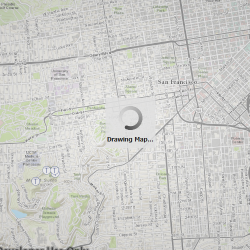

# Display drawing status

This sample demonstrates how to use the `DrawStatus` value of the `MapView` to notify the user that the `MapView` is drawing.

## How it works
Using the `onDrawStatusChanged` signal handler, the `visible` property of a popup `Rectangle` is set to true if the `MapView`'s `DrawStatus` is `InProgress` and false if it is `Completed`. 

## Features
- MapView
- Map
- FeatureLayer
- ServiceFeatureTable
- Viewpoint
- Envelope

