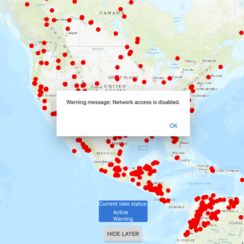

# Display layer view draw state

This sample demonstrates how to get the view status of a `Layer` in a `Map`.

## How it works
`MapView` has a signal called `layerViewStateChanged` that gets emitted every time a layer's view status changes. Using the `onLayerViewStateChanged` signal handler, the signal's two arguments, layer, the `Layer` whose state changed, and layerViewState, the `LayerViewState` object defining the new state, can be accessed.

## Features
- MapView
- Map
- ArcGISTiledLayer
- ArcGISMapImageLayer
- FeatureLayer
- ServiceFeatureTable
- ViewpointCenter
- Point
- SpatialReference
