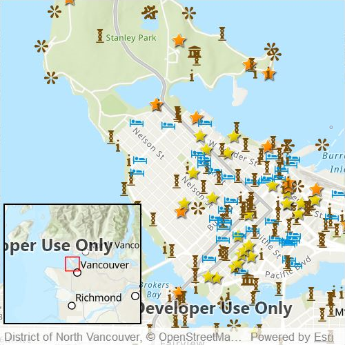

# Display overview map

Include an overview or inset map as an additional map view to show the wider context of the primary view.

## Use case

An overview map provides a useful, smaller-scale overview of the current map view's location. For example, when you need to inspect a layer with many features while remaining aware of the wider context of the view, use an overview map to help show the extent of the main map view.

## How to use the sample

Pan or zoom across the map view to browse through the tourist attractions feature layer and watch the viewpoint or scale of the linked overview map update automatically. You can also navigate by panning and zooming on the overview map directly.

## How it works

1. Declare a `MapView` containing a `Map` with the `ArcGISTopographic` basemap style.
2. Add a `FeatureLayer` to the `Map` using a `ServiceFeatureTable`.
3. Declare a `Rectangle` to use as a border and add an `OverviewMap` component from the ArcGIS Maps SDK for Qt Toolkit.
4. Assign the `MapView` to the `geoView` property of the `OverviewMap` to connect the `MapView` with the `OverviewMap`.

## Relevant API

* MapView
* OverviewMap

## About the data

The data used in this sample is the [OpenStreetMap Tourist Attractions for North America](https://www.arcgis.com/home/item.html?id=97ceed5cfc984b4399e23888f6252856) feature layer, which is scale-dependent and displays at scales larger than 1:160,000.

## Additional information

 This sample uses the overview map toolkit component, which requires the [toolkit](https://github.com/Esri/arcgis-maps-sdk-toolkit-qt) to be cloned and set up locally. For information about setting up the toolkit, visit the repository's [UI Tools page](https://github.com/Esri/arcgis-maps-sdk-toolkit-qt/blob/main/uitools).

## Tags

context, inset, map, minimap, overview, preview, small scale, toolkit, view
