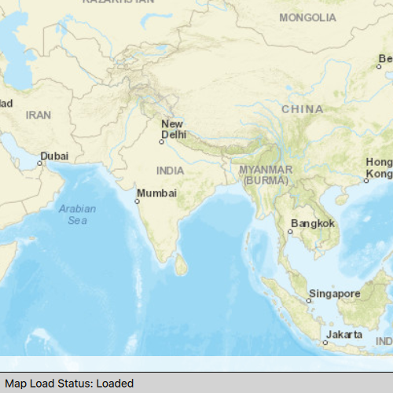

# Map loaded

Determine the map's load status which can be: `NotLoaded`, `FailedToLoad`, `Loading`, `Loaded`, `Unknown`.

## Use case

Knowing the map's load state may be required before subsequent actions can be executed.

## How to use the sample

Click on the button to reload the Map. The load status of the Map will be displayed on screen.

## How it works

1. Create a `Map` and add it to a `MapView`.
2. Connect to the `Map`'s `onloadStatusChanged` signal to query the map's load status. The `loadStatus` is `Enums.LoadStatusLoaded` when any of the following criteria are met:
  * The map has a valid spatial reference.
  * The map has an an initial viewpoint.
  * One of the map's predefined layers has been created.

## Relevant API

* Map
* LoadStatusChanged
* MapView

## Tags

LoadStatus, Map, Loadable pattern
