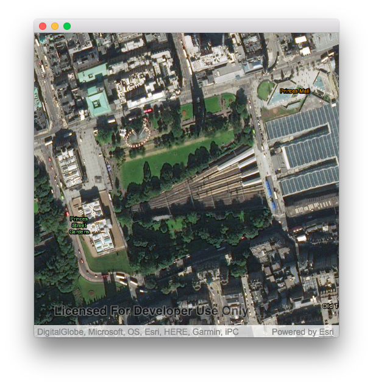

# Min-Max Scale

This sample demonstrates how to set the minimum and maximum scale of a map.

## How to use the sample
Use the mousewheel or pinch gesture to zoom in and out of the map. Notice that the scale of which you can do that is limited by the application.

## How it works
1. A MapView is declared with a nested Map object as a child. The streets basemap is then added as the map's basemap.
2. The Map QML object has two properties called `minScale` and `maxScale`. The latter restricts how far you can zoom out, and the former how far you can zoom in. These properties are set to a desired range while ensuring that `maxScale` is less than `minScale`.

## Relevant API
 - Map.minScale
 - Map.maxScale

## Tags
Maps, 2D, scale, minScale, maxScale
