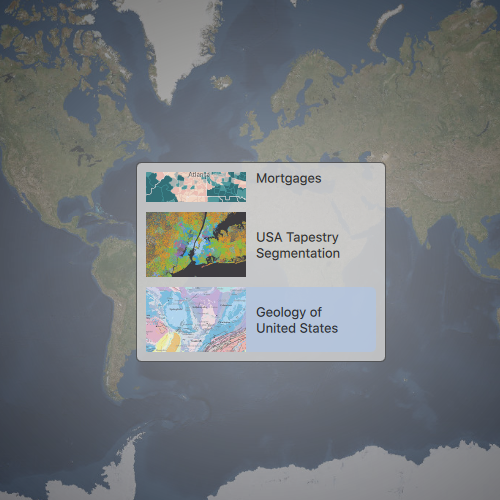

# Open Map (URL)

This sample demonstrates how to open an existing map from a URL.

## How it works

The existing maps are web maps stored in ArcGIS Online. The webmaps are presented in a list view with the item's thumbnail, title and item ID. When a webmap is selected, a url is constructed using the item ID, a new map object is created from that initial Url, and the new map object is assigned the map view.

## Features
- MapView
- Map
- Basemap
