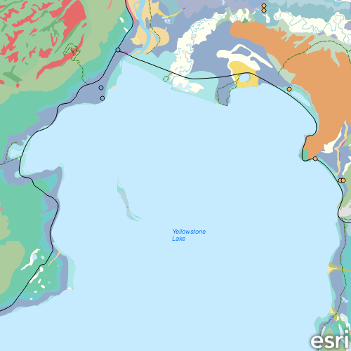

# Open mobile map (map package)

Display a map from a mobile map package.

## Use case

An .mmpk file is an archive containing the data (specifically, basemaps and features) used to display an offline map.

## How to use the sample

When the sample opens, it will automatically display the map in the mobile map package. Pan and zoom to observe the data from the mobile map package.

## How it works

1. Create a `MobileMapPackage` specifying the path to the .mmpk file.
2. Load the mobile map package with `mmpk.load()`.
3. After it successfully loads, get the map from the .mmpk and add it to the map view: `mapView.map = mmpk.maps[0]`.

## Relevant API

* MapView
* MobileMapPackage

## Offline Data

Read more about how to set up the sample's offline data [here](http://links.esri.com/ArcGISRuntimeQtSamples#use-offline-data-in-the-samples).

Link | Local Location
---------|-------|
|[Yellowstone Mobile Map Package](https://www.arcgis.com/home/item.html?id=e1f3a7254cb845b09450f54937c16061)| `<userhome>`/ArcGIS/Runtime/Data/mmpk/Yellowstone.mmpk |

## Tags

mmpk, mobile map package, offline
