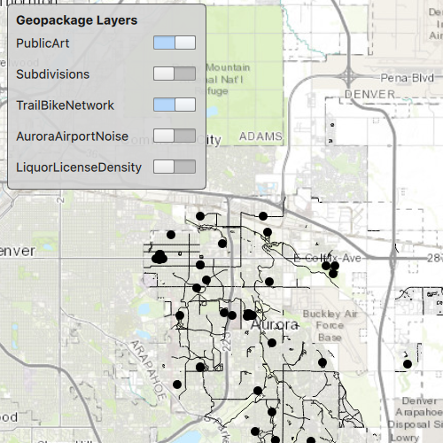

# Read a GeoPackage

Add rasters and feature tables from a GeoPackage to a map.

## Use case

The OGC GeoPackage specification defines an open standard for sharing raster and vector data. You may want to use GeoPackage files to support file-based sharing of geographic data.

## How to use the sample

When the sample loads, the feature tables and rasters from the GeoPackage will be shown on the map.

## How it works

1. Create a `GeoPackage` object using the path the local geoPackage.
2. Connect to the `GeoPackage.loadStatusChanged` signal.
3. Load the geoPackage `geoPackage.load()`, then iterate through the available rasters, exposed by `geopackage.geoPackageRasters`.
    * For each raster, create a raster layer then add it to the map.
4. Iterate through available feature tables, exposed by `geopackage.geoPackageFeatureTables`.
    * For each feature table, create a feature layer then add it to the map.

## Relevant API

* GeoPackage
* GeoPackage.loadStatusChanged
* GeoPackage.geoPackageFeatureTables
* GeoPackage.geoPackageRasters
* GeoPackageFeatureTable
* GeoPackageRaster

## Offline data

Read more about how to set up the sample's offline data [here](http://links.esri.com/ArcGISRuntimeQtSamples#use-offline-data-in-the-samples).

Link | Local Location
---------|-------|
|[AuroraCO.gpkg](https://www.arcgis.com/home/item.html?id=68ec42517cdd439e81b036210483e8e7)| `<userhome>`/ArcGIS/Runtime/Data/gpkg/AuroraCO.gpkg |

## About the data

This sample features a GeoPackage with datasets that cover Aurora, Colorado: Public art (points), Bike trails (lines), Subdivisions (polygons), Airport noise (raster), and liquour license density (raster).

## Additional information

GeoPackage uses a single SQLite file (.gpkg) that conforms to the OGC GeoPackage Standard. You can create a GeoPackage file (.gpkg) from your own data using the create a SQLite Database tool in ArcGIS Pro.

## Tags

container, GeoPackage, layer, map, OGC, package, raster, table
