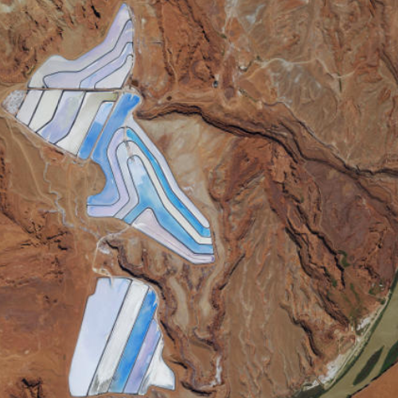

# Set initial map area

Display a map with a predefined initial extent.

## Use case

You can set a map's initial location when you want to highlight a particular feature or area to establish the context.

## How to use the sample

When the map loads, note the specific location of the initial map view.

## How it works

1. Create a `Envelope(xMin, yMin, xMax, yMax, SpatialReference)`.
2. Create a `ViewpointExtent` containing the envelope.
3. Set the initial viewpoint of the map to the viewpoint extent.

## Relevant API

* Basemap
* Map
* MapView

## About the data

The map opens with satellite imagery of a guitar-shaped field in the Pampas region of north central Argentina.

## Tags

basemap, center, envelope, extent, initial, lat, latitude, level of detail, location, LOD, long, longitude, scale, zoom level
