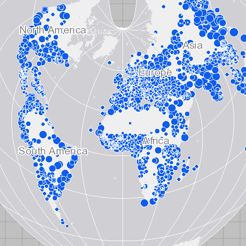

# Set map spatial reference

Specify a map's spatial reference.

## Use case

Choosing the correct spatial reference is important for ensuring accurate projection of data points to a map.  

## How to use the sample

Pan and zoom around the map. Observe how the map is displayed using the World Bonne spatial reference.

## How it works

1. Create an `Map` object using a spatial reference.
2. Create a `Basemap` object using an `ArcGISMapImageLayer` object.
3. Set the base map to the map.
4. Set the map to a `MapView` object.

The ArcGIS map image layer will now use the spatial reference set to the ArcGIS map (World Bonne (WKID: 54024)) and not it's default spatial reference.

## Relevant API

* ArcGISMapImageLayer
* Basemap
* Map
* MapView
* SpatialReference

## Additional information

Operational layers will automatically project to this spatial reference when possible.

## Tags

project, SpatialReference, WKID
