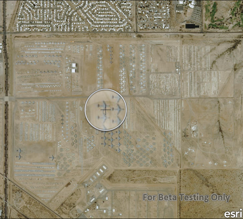

#Show magnifier

This sample demonstrates how you can tap and hold on a map to get the magnifier. You can also pan while tapping and holding to move the magnifier across the map.

##How it works

MapView has a magnifierEnabled property that determines whether a magnifier should be shown on the map when the user performs a tap and hold gesture. Its default value is false. You can also use the magnifierMapPanningEnabled property to indicate whether the map should be panned automatically when the magnifer gets near the edge of the map's bounds.

##Features
- MapView
- Map
- Basemap
