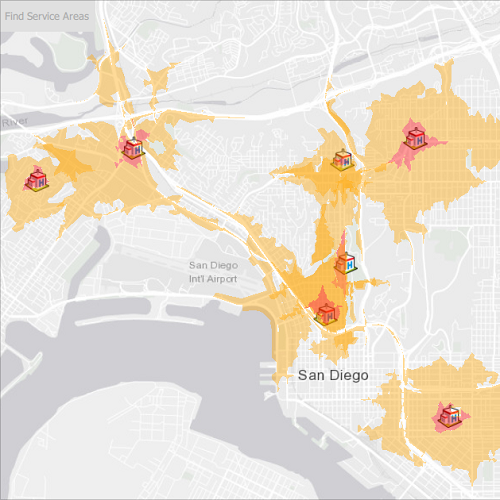

# Find service areas for multiple facilities

Find the service areas of several facilities from a feature service.

## Use case

A city taxi company may calculate service areas around their vehicle lots to identify gaps in coverage. Alternatively, they may want to ensure overlaps where a high volume of passengers requires redundant facilities, such as near an airport.

## How to use the sample

Click 'Find service areas' to calculate and display the service area of each facility (hospital) on the map. The polygons displayed around each facility represent the facility's service area: the red area is within 1 minute travel time from the hospital by car, whilst orange is within 3 minutes by car. All service areas are semi-transparent to show where they overlap.

## How it works

1. Create a new `ServiceAreaTask` from a network service.
2. Create default `ServiceAreaParameters` from the service area task.
3. Set the parameters `ServiceAreaParameters.returnPolygons = true` to return polygons of all service areas.
4. Define `QueryParameters` that retrieve all `Facility` items from a `ServiceFeatureTable`. Add the facilities to the service area parameters using the query parameters, `serviceAreaParameters.SetFacilitiesWithFeatureTable(facilitiesTable, queryParameters).`
5. Get the `ServiceAreaResult` by solving the service area task using the parameters.
6. For each facility, get any `ServiceAreaPolygons` that were returned, `serviceAreaResult.resultPolygons(facilityIndex)`.
7. Display the service area polygons as `Graphics` in a `GraphicsOverlay` on the `MapView`.

## Relevant API

 * ServiceAreaParameters
 * ServiceAreaPolygon
 * ServiceAreaResult
 * ServiceAreaTask

## About the data

This sample uses a street map of San Diego, in combination with a feature service with facilities (used here to represent hospitals). Additionally a street network is used on the server for calculating the service area.

## Tags

facilities, feature service, impedance, network analysis, service area, travel time