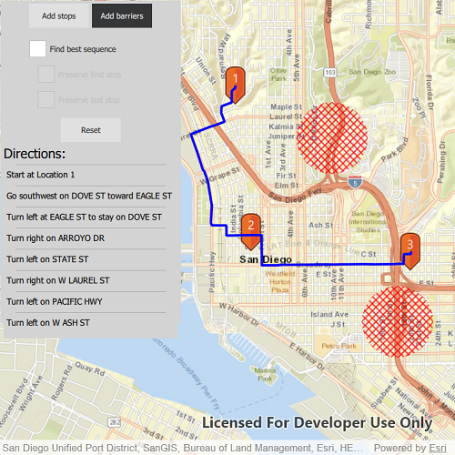

# Route around barriers

Find a route that reaches all stops without crossing any barriers.

## Use case

You can define barriers to avoid unsafe areas, for example flooded roads, when planning the most efficient route to evacuate a hurricane zone. When solving a route, barriers allow you to define portions of the road network that cannot be traversed. You could also use this functionality to plan routes when you know an area will be inaccessible due to a community activity like an organized race or a market night.

In some situations, it is further beneficial to find the most efficient route that reaches all stops, reordering them to reduce travel time. For example, a delivery service may target a number of drop-off addresses, specifically looking to avoid congested areas or closed roads, arranging the stops in the most time-effective order.

## How to use the sample

Click 'Add stop' to add stops to the route. Click 'Add barrier' to add areas that can't be crossed by the route. Select 'Find best sequence' to allow stops to be re-ordered in order to find an optimum route. Select 'Preserve first stop' to preserve the first stop. Select 'Preserve last stop' to preserve the last stop.

## How it works

1. Construct a `RouteTask` with the URL to a Network Analysis route service.
2. Get the default `RouteParameters` for the service, and create the desired `Stop`s and `PolygonBarrier`s.
3. Add the stops and barriers to the route's parameters, `routeParameters.setStops(routeStops)` and `routeParameters.setPolygonBarriers(routeBarriers)`.
4. Set the `returnStops` and `returnDirections` to `true`.
5. If the user will accept routes with the stops in any order, set `findBestSequence` to `true` to find the most optimal route.
6. If the user has a definite start point, set `preserveFirstStop` to `true`.
7. If the user has a definite final destination, set `preserveLastStop` to `true`.
8. Call `routeTask.solveRoute(routeParameters)` to get a `RouteResult`.
9. Get the first returned route by calling `solveRouteResult.routes[0]`.
10. Get the geometry from the route to display the route to the map.

## Relevant API

* DirectionManeuverListModel
* PolygonBarrier
* Route
* RouteParameters
* RouteResult
* RouteTask
* Stop

## About the data

This sample uses an Esri-hosted sample street network for San Diego.

## Tags

barriers, best sequence, directions, maneuver, network analysis, routing, sequence, stop order, stops
