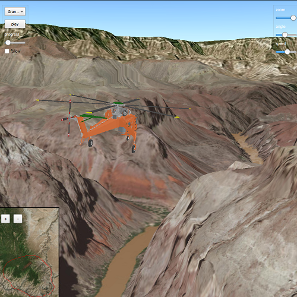

# Animate 3D symbols

Demonstrates how to animate a graphic's position and rotation and follow it using a `OrbitGeoElementCameraController`.
Also shows how to combine a `SceneView` and `MapView` in an MVC application with property binding.

## How to use the sample

Animation Controls (Top Left Corner):
 - Select a mission -- selects a location with a route for the plane to fly
 - Play/Pause -- toggles playing and stopping the animation
 - Fixed/Follow -- toggles the camera's free cam mode and follow
 - Mission progress -- shows how far along the route the plane is. Slide to change keyframe in animation

Camera Controls (Top Right Corner):
 - Camare zoom -- distance between camera and plane
 - Camera angle -- viewing angle between camera and plane
 - Flight speed -- controls speed of animation

 2D Map Controls (Bottom Left Corner):
 - Plus and Minus -- controls distance of 2D view from ground level

## How it works

1. Create a `GraphicsOverlay` and add it to the `SceneView`.
2. Create a `ModelSceneSymbol` object.
3. Create a `Graphic` object and set its geometry to a `Point`.
4. Set the `ModelSceneSymbol` object to the graphic.
5. Add heading, pitch, and roll attributes to the graphic. Get the attributes from the graphic with `Graphic::attributes`.
6. Create a `SimpleRenderer` object and set its expression properties.
7. Add graphic and a renderer to the graphics overlay.
8. Create a `OrbitGeoElementCameraController` which is set to target the graphic.
9. Assign the camera controller to the `SceneView`.
10. Update the graphic's location, heading, pitch, and roll.

## Relevant API

* Scene
* Camera
* GlobeCameraController
* Graphic
* GraphicsOverlay
* ModelSceneSymbol
* OrbitGeoElementCameraController
* Renderer
* SceneProperties
* SceneView
* SurfacePlacement

## Offline Data

Read more about how to set up the sample's offline data [here](http://links.esri.com/ArcGISRuntimeQtSamples#use-offline-data-in-the-samples).

Link | Local Location
---------|-------|
|[Model Marker Symbol Data](https://www.arcgis.com/home/item.html?id=681d6f7694644709a7c830ec57a2d72b)| `<userhome>`/ArcGIS/Runtime/Data/3D/Bristol/Collada/Bristol.dae |
|[GrandCanyon.csv mission data](https://www.arcgis.com/home/item.html?id=290f0c571c394461a8b58b6775d0bd63)| `<userhome>`/ArcGIS/Runtime/Data/3D/Missions/GrandCanyon.csv |
|[Hawaii.csv mission data](https://www.arcgis.com/home/item.html?id=e87c154fb9c2487f999143df5b08e9b1)| `<userhome>`/ArcGIS/Runtime/Data/3D/Missions/Hawaii.csv |
|[Pyrenees.csv mission data](https://www.arcgis.com/home/item.html?id=5a9b60cee9ba41e79640a06bcdf8084d)| `<userhome>`/ArcGIS/Runtime/Data/3D/Missions/Pyrenees.csv |
|[Snowdon.csv mission data](https://www.arcgis.com/home/item.html?id=12509ffdc684437f8f2656b0129d2c13)| `<userhome>`/ArcGIS/Runtime/Data/3D/Missions/Snowdon.csv |

## Tags

animation, camera, heading, pitch, roll, rotation, visualize
