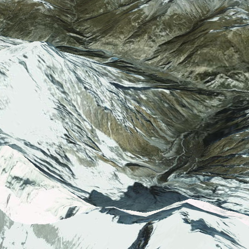

# Display a scene

This sample demonstrates how to display a scene with an elevation surface.

## How it works

This is the most basic sample for displaying a scene. It shows how to create a scene view, and add in a scene that contains a surface.

## Features
- SceneView
- Scene
- Basemap
- Surface
