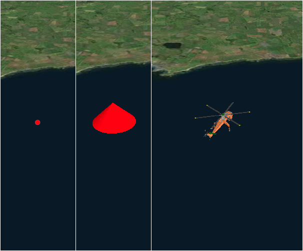

#Distance Composite Symbol (URL)

This sample demonstrates how to create a graphic using a distance composite scene symbol. Distance composite scene symbols can render different symbols depending on the distance between the camera and the graphic.



##How it works

To create and display a ```DistanceCompositeSceneSymbol```:

1. Create a ```GraphicsOverlay``` and add it to the ```SceneView```.
2. Create symbols for each ```Range``` the composite symbol.
3. Create a distance composite scene symbol`.
4. Add a range for each symbol.
5. Create a ```Graphic``` with the symbol.
6. Add the graphic to the graphics overlay.

##Features
- Scene
- ArcGISTiledElevationSource
- Camera
- DistanceCompositeSceneSymbol
- DistanceCompositeSceneSymbol.Range
- Graphic
- GraphicsOverlay
- ModelSceneSymbol
- Range
- RangeCollection
- SceneView
- SimpleMarkerSceneSymbol

##Offline Data
Read more about how to set up the sample's offline data [here](http://links.esri.com/ArcGISRuntimeQtSamples).

Link | Local Location
---------|-------|
|[Model Marker Symbol Data](https://www.arcgis.com/home/item.html?id=810a20c8be914170948d4c2d2146b4c5)| `<userhome>`/ArcGIS/Runtime/Data/3D/SkyCrane/SkyCrane.lwo |
