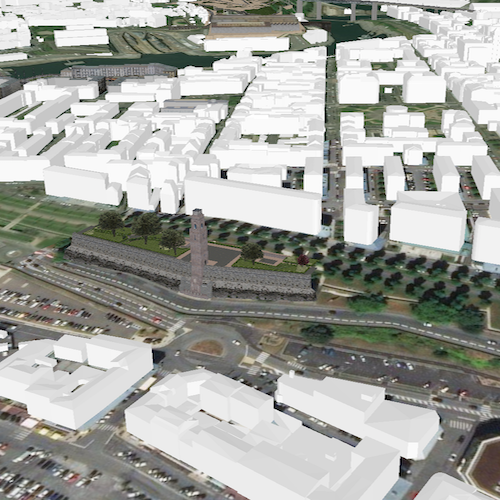

# Open a scene (portal item)

This sample demonstrates how to open a scene from a Portal item. Just like web maps are the ArcGIS format for maps, web scenes are the ArcGIS format for scenes. These scenes can be stored in ArcGIS Online or Portal.

## How to use the sample
When the sample loads, a scene from ArcGIS Online will be displayed.

## How it works
- A `Scene` is declared as a child of a `SceneView`.
- A `PortalItem` with an item ID is declared as a child of the `Scene`. Since the `portalItem` is a default property of `Scene`, this information is used to create a web scene.

## Relevant API
- Scene
- PortalItem

## Tags
Scenes, Web Scene, Portal
