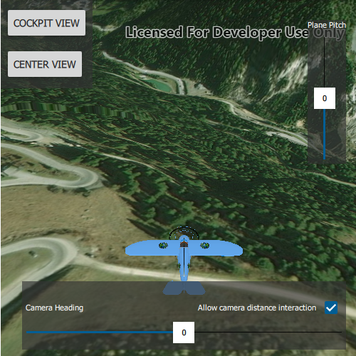

# Orbit the camera around an object

Fix the camera to point at and rotate around a target object.

## Use case

The orbit geoelement camera controller provides control over the following camera behaviors:

*   automatically track the target
*   stay near the target by setting a minimum and maximum distance offset
*   restrict where you can rotate around the target
*   automatically rotate the camera when the target's heading and pitch changes
*   disable user interactions for rotating the camera
*   animate camera movement over a specified duration
*   control the vertical positioning of the target on the screen
*   set a target offset (e.g.to orbit around the tail of the plane) instead of defaulting to orbiting the center of the object

## How to use the sample

The sample loads with the camera orbiting an plane model. The camera is preset with a restricted camera heading and pitch, and a limited minimum and maximum camera distance set from the plane. The position of the plane on the screen is also set just below center.  

Use the "Camera Heading" slider to adjust the camera heading. Select the "Allow camera distance interaction" checkbox to allow zooming in and out with the mouse/keyboard: when the checkbox is deselected the user will be unable to adjust with the camera distance.  

Use the "Plane Pitch" slider to adjust the plane's pitch. When in Center view, the plane's pitch will change independently to that of the camera pitch.  

Use the "Cockpit view" button to offset and fix the camera into the cockpit of the plane. Use the "Plane pitch" slider to control the pitch of plane: the camera will follow the pitch of the plane in this mode. In this view adjusting the camera distance is disabled. Use the "Center view" button to exit cockpit view mode and fix the camera controller on the center of the plane.  

## How it works

1. Declare an `OrbitGeoElementCameraController`
2. Load a plane graphic and set the `OrbitGeoElementCameraController` to be the targetGeoElement
3. Assign this controller to the `cameraController` sceneview property to set the camera to the scene view  
4. Set the heading, pitch and distance camera properties :
 * `OrbitGeoElementCameraController.cameraHeadingOffset`
 * `OrbitGeoElementCameraController.cameraPitchOffset`
 * `OrbitGeoElementCameraController.cameraDistance`
5. Set the minimum and maximum angle of heading and pitch, and minimum and maximum distance for the camera with properties:
 * `OrbitGeoElementCameraController.minCameraHeadingOffset` or `maxCameraHeadingOffset`
 * `OrbitGeoElementCameraController.minCameraHeadingOffset` or `maxCameraPitchOffset`
 * `OrbitGeoElementCameraController.minCameraHeadingOffset` or `maxCameraDistance`
6. Set the distance from which the camera is offset from the plane with method:
 * `OrbitGeoElementCameraController.setTargetOffsets(x, y, z, duration)`
 * or properties :
 * `OrbitGeoElementCameraController.targetOffsetX`
 * `OrbitGeoElementCameraController.targetOffsetY`
 * `OrbitGeoElementCameraController.targetOffsetZ`
7. Set the vertical screen factor to determine where the plane appears in the scene:
 * `OrbitGeoElementCameraController.targetVerticalScreenFactor`
8. Animate the camera to the cockpit using `orbitCameraController.setTargetOffsets(x, y, z, duration)`  
9. Set if the camera distance will adjust when zooming or panning using mouse or keyboard (default is true):
 * `OrbitGeoElementCameraController.cameraDistanceInteractive`
10. Set if the camera will follow the pitch of the plane (default is true):
 * `OrbitGeoElementCameraController.autoPitchEnabled`

## Relevant API

*   OrbitGeoElementCameraController

## Offline data

Read more about how to set up the sample's offline data [here](http://links.esri.com/ArcGISRuntimeQtSamples#use-offline-data-in-the-samples).

Link | Local Location
---------|-------|
|[Bristol Plane Model](https://www.arcgis.com/home/item.html?id=681d6f7694644709a7c830ec57a2d72b)| `<userhome>`/ArcGIS/Runtime/Data/3D/Bristol/Collada/Bristol.dae |

## Tags

3D, camera, object, orbit, rotate, scene
