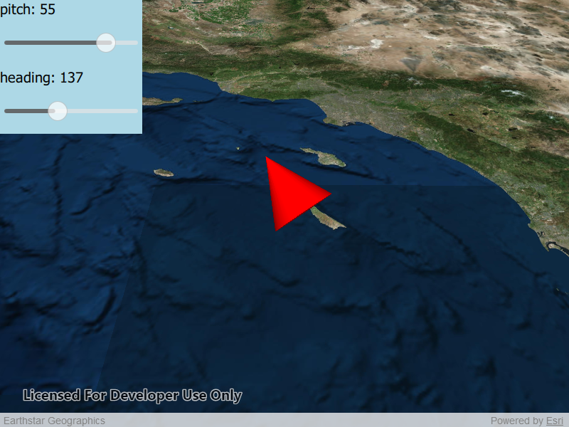

# Scene Properties Expressions

This sample demonstrates how to update the orientation of a graphic using scene property rotation expressions.

## How to use the sample
Move the `Heading` and `Pitch` sliders to change the orientation of graphics in the graphics overlay.

## How it works
The sample creates a SimpleRenderer within a GraphicOverlay. The SimpleRenderer has expressions for `HEADING` and `PITCH`, which are set via `headingExpression: "[Heading]"`. A graphic is created and its rotation is set by `coneGraphic.attributes.insertAttribute("Heading", initialHeading);` where the attribute key is `"Heading"` and `initialHeading` is the rotation angle.

## Relevant API
 * SimpleRenderer
 * GraphicsOverlay
 * RendererSceneProperties

## Tags
Scenes, 3D, Expressions, Attributes, rotation, heading, pitch

