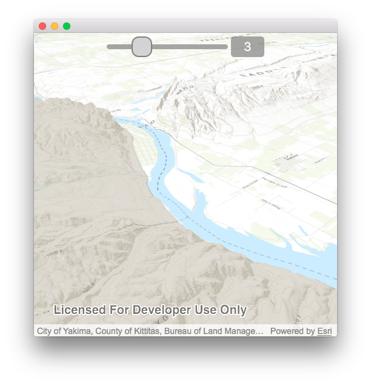

# Terrain exaggeration

Vertically exaggerate terrain in a scene.

## Use case

Vertical exaggeration can be used to emphasize subtle changes in a surface. This can be useful in creating visualizations of terrain where the horizontal extent of the surface is significantly greater than the amount of vertical change in the surface. A fractional vertical exaggeration can be used to flatten surfaces or features that have extreme vertical variation.

## How to use the sample

Use the slider to update terrain exaggeration.

## How it works
1. Create a scene.
2. Create and add a surface with an ArcGISTiledElevationService.
    * The surface visualizes the elevation source.
    * An elevation source defines the terrain based on a digital elevation model (DEM) or digital terrain model (DTM).
3. Create a slider object.
4. Bind the surface's `elevationExaggeration` property to the slider's value.

## Relevant API

* Scene
* Scene.baseSurface
* Surface
* Surface.elevationExaggeration

## Tags

3D, DEM, DTM, elevation, scene, surface, terrain
