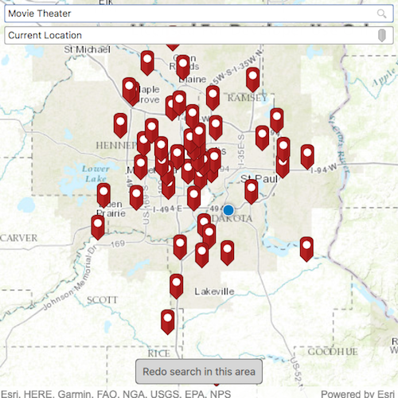

# Find a place

This sample demonstrates how to use geocode functionality to search for
points of interest around a location or within an extent.

## How it works

Two text boxes allow you to input a point of interest (such as “Movie
Theater”, “Starbucks”, or “Park”), as well as a location. Setting a
location will set the preferred search location, so that geocode results
closer to that location are preferred. Optionally, tap the pin symbol in
the text box to search near your current location. When you pan the map
and change the current viewpoint, a button will appear, allowing you to
search the current map extent for a place of interest.

This workflow is accomplished by creating a `LocatorTask` with the URL
to the World Geocoding Service. Suggestions are obtained by binding the
locator’s suggestion `searchText` to the text boxes. Binding this
property to the text box results in suggestions being fetched
automatically whenever this searchText changes. “POI” and “Populated
Place” categories are set on the `SuggestionParameters` so that the
suggestions for each text box make sense. Once a suggestion is selected
or enter is hit on the keyboard, `geocodeWithParameters` is called. The
`GeocodeParameters` sets the `preferredSearchLocation`, so that results
near this location are preferred. If the button to search within an
extent is clicked, the `searchArea` property is set to the MapView’s
current viewpoint. Search area differs from preferred search location
because it only shows results within the search area, whereas the
preferred search area only prefers closer results over further results.
Once the geocode completes successfully, a `Graphic` is created for each
`GeocodeResult`, and is added to a `GraphicsOverlay` for display on the
Map.
