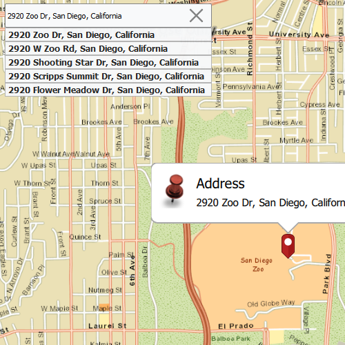

#Offline geocode

This sample demonstrates how to geocode and reverse geocode addresses and locations without network connectivity.

##How it works
An `ArcGISTiledLayer` and `LocatorTask` are created using local files. Geocoding is performed through inputs from a `TextField`. ReverseGeocoding is handled with various mouse events. Information from geocoding tasks is visually displayed through a `PictureMarkerSymbol` graphic and a `Callout`. Suggestions are handled with a `SuggestListModel` whose `searchText` property is bound to the text property of the TextField; as the text property changes, the suggestions will automatically update.

##Features
- Map
- MapView
- ArcGISTiledLayer
- TileCache
- GraphicsOverlay
- PictureMarkerSymbol
- Callout
- LocatorTask
- GeocodeParameters
- ReverseGeocodeParameters
- GeocodeResult
- SuggestListModel
- Viewpoint

##Offline Data
Read more about how to set up the sample's offline data [here](http://links.esri.com/ArcGISRuntimeQtSamples).

Link | Local Location
---------|-------|
|[SanDiego tpk File](https://www.arcgis.com/home/item.html?id=7277419732964266b909bf2bae1ddb54)| `<userhome>`/ArcGIS/Runtime/Data/tpk/streetmap_SD.tpk |
|[SanDiego loc Files](https://www.arcgis.com/home/item.html?id=c88c170e18f74740a0e4c660a5ff51c4)| `<userhome>`/ArcGIS/Runtime/Data/Locators/SanDiegoStreetAddress/SanDiego_StreetAddress.loc |
