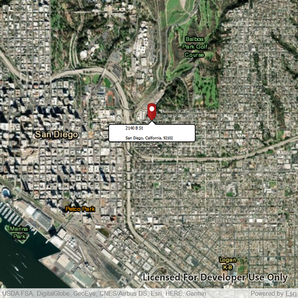

# Reverse geocode

Use an online service to find the address for a tapped point.

## Use case

You might use a geocoder to find a customer's delivery address based on the location returned by their device's GPS.

## How to use the sample

Tap the map to see the nearest address displayed in a callout.

## How it works

1. Create the `Map` with a `Basemap`.
2. Create a `LocatorTask` using a URL.
3. Set the `ReverseGeocodeParameters` for the `LocatorTask` and specify the geocode's attributes.
4. Get the matching results from the `GeocodeResult` using `ReverseGeocodeWithParameters`
5. Change the attributes of the `MapView`'s `CalloutData` and display the location using a `Callout`

## Relevant API

* GeocodeParameters
* LocatorTask
* ReverseGeocodeParameters

## Offline data

Read more about how to set up the sample's offline data [here](http://links.esri.com/ArcGISRuntimeQtSamples#use-offline-data-in-the-samples).

Link | Local Location
---------|-------|
[pin PNG file](https://github.com/Esri/arcgis-runtime-samples-java/blob/master/search/reverse-geocode-online/src/main/resources/pin.png)| `<userhome>`/ArcGIS/Runtime/Data/symbol/pin.png |

## Tags

address, geocode, locate, reverse geocode, search
