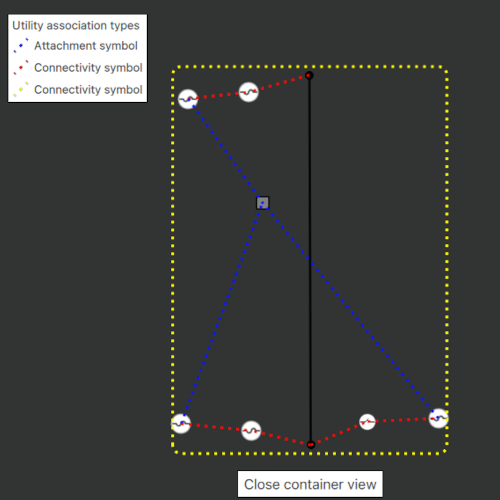

# Display Content of Utility Network Container

A utility network container allows a dense collection of features to be represented by a single feature, which can be used to reduce map clutter.

## Use case

Offering a container view for features aids in the review for valid structural attachment and containment relationships and helps determine if a dataset has an association role set. Container views often model a cluster of electrical devices on a pole top or inside a cabinet or vault.

## How to use the sample

Tap on a container feature to show all features inside the container. The container is shown as a polygon graphic with the content features contained within. The viewpoint and scale of the map are also changed to the container's extent. Connectivity and attachment associations inside the container are shown as red and blue dotted lines respectively.

## How it works

1. Load a web map that includes ArcGIS Pro [Subtype Group Layers](https://pro.arcgis.com/en/pro-app/latest/help/mapping/layer-properties/subtype-layers.htm) with only container features visible (i.e. fuse bank, switch bank, transformer bank, hand hole and junction box).
2. Create and load a UtilityNetwork with the same feature service URL as the layers in the Map.
3. Add a `GraphicsOverlay` for displaying a container view.
4. Identify a feature with `MapView.identifyLayers()` and create a `UtilityElement` from it.
5. Get the associations for this element using `UtilityNetwork.associations(UtilityElement, Enums.UtilityAssociationTypeContainment)`.
6. Turn-off the visibility of all `OperationalLayers`.
7. Get the features for the `UtilityElement`(s) from the associations using `UtilityNetwork.featuresForElements()`
8. Create a `Graphic` with the geometry and symbol of each feature and add it to the `GraphicsOverlay`.
9. Get associations for the extent of the `GraphicsOverlay` using `UtilityNetwork.associationsWithEnvelope()`
10. Add a `Graphic` to represent the association geometry between the container features using a symbol that distinguishes between `Attachment` and `Connectivity` association type.
11. Add another `Graphic` that represents this extent and zoom to this extent with some buffer.

## Relevant API

* SubtypeFeatureLayer
* UtilityAssociation
* UtilityAssociationType
* UtilityElement
* UtilityNetwork

## About the data

The [Naperville electric network feature service](https://sampleserver7.arcgisonline.com/server/rest/services/UtilityNetwork/NapervilleElectric/FeatureServer), hosted on ArcGIS Online, contains a utility network used to find associations shown in this sample and a web map portal item, [Naperville electric containers](https://sampleserver7.arcgisonline.com/portal/home/item.html?id=813eda749a9444e4a9d833a4db19e1c8), that use the same feature service endpoint and displays only container features.

## Tags

associations, connectivity association, containment association, structural attachment associations, utility network
