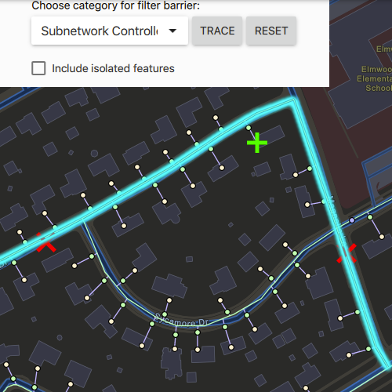

# Perform valve isolation trace

Run a filtered trace to locate operable features that will isolate an area from the flow of network resources.

## Use case

Determine the set of operable features required to stop a network's resource, effectively isolating an area of the network. For example, you can choose to return only accessible and operable valves: ones that are not paved over or rusted shut.

## How to use the sample

Create and set the configuration's filter barriers by selecting a category. Check or uncheck 'Include isolated features'. Click 'Trace' to run a subnetwork-based isolation trace.

## How it works

1.  Create a `MapView`.
2.  Create and load a `UtilityNetwork` with a feature service URL.
3.  Create a `Map` that contains `FeatureLayer`(s) that are part of this utility network.
4.  Create a default starting location from a given asset type and global id.
5.  Add a `GraphicsOverlay` with a `Graphic` that represents this starting location.
6.  Populate the choice list for the 'Filter barrier: category exists' from `UtilityNetworkDefinition.categories`.
7.  Get a default `UtilityTraceConfiguration` from a given tier in a domain network. Set its `Filter` with a new `UtilityTraceFilter`.
8.  When 'Trace' is clicked,
    - Create a new `UtilityCategoryComparison` with the selected category and `Enums.UtilityCategoryComparisonOperatorExists`. 
    - Assign this condition to `TraceFilter.barriers` from the default configuration from step 7. Update this configuration's `includeIsolatedFeatures` property. 
    - Create a `UtilityTraceParameters` with `Enums.UtilityTraceTypeIsolation` and default starting location from step 4. 
    - Set its `TraceConfiguration` with this configuration and then, run a `UtilityNetwork.trace()`.
9.  For every `FeatureLayer` in the map, select the features returned by `featuresForElements` from the elements matching their `NetworkSource.name` with the layer's `FeatureTable.name`.

## Relevant API

* UtilityCategory
* UtilityCategoryComparison
* UtilityCategoryComparisonOperator
* UtilityDomainNetwork
* UtilityElement
* UtilityElementTraceResult
* UtilityNetwork
* UtilityNetworkDefinition
* UtilityTier
* UtilityTraceFilter
* UtilityTraceParameters
* UtilityTraceResult
* UtilityTraceType

## About the data

The [Naperville gas network feature service](https://sampleserver7.arcgisonline.com/arcgis/rest/services/UtilityNetwork/NapervilleGas/FeatureServer), hosted on ArcGIS Online, contains a utility network used to run the isolation trace shown in this sample.

## Tags

category comparison, condition barriers, isolated features, network analysis, subnetwork trace, trace configuration, trace filter, utility network
