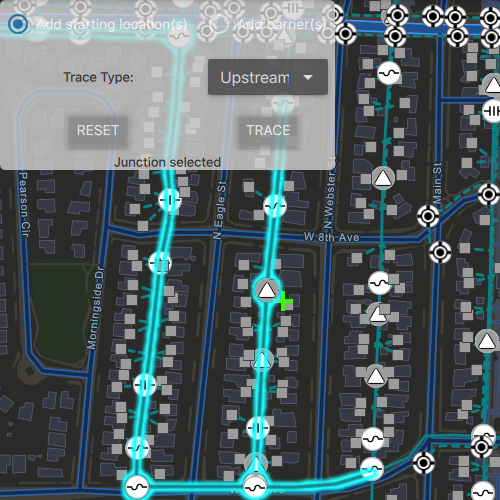

# Trace utility network

Find all features connected to a set of starting points in a utility network.

## Use case

This is useful to visualize and validate the network topology of a utility network for quality assurance.

## How to use the sample

To add a starting point, select 'Add starting location(s)' and tap on one or more features. To add a barrier, select 'Add barrier(s)' and tap on one or more features. Depending on the type of feature, you may be prompted to select a terminal or the distance from the tapped location will be computed. Click 'Trace' to highlight all features connected to the specified starting locations and not positioned beyond the barriers. Click 'Reset' to clear parameters and start over.

## How it works

1. Create a `MapView` and connect to its `mouseClicked` signal.
2. Create and load a `Map` that contains `FeatureLayer`(s) that are part of a utility network.
3. Create and load a `UtilityNetwork` with the same feature service URL and map.
4. Add a `GraphicsOverlay` with symbology that distinguishes starting points from barriers.
5. Identify features on the map and add a `Graphic` that represents its purpose (starting point or barrier) at the location of each identified feature.
6.  Create a `UtilityElement` for the identified feature.
7.  Determine the type of this element using its `NetworkSource.sourceType` property.
8.  If the element is a junction with more than one terminal, display a terminal picker. Then set the junction's `terminal` property with the selected terminal.
9.  If an edge, set its `fractionAlongEdge` property using `GeometryEngine.fractionAlong`.
10. Add this utility element to a collection of starting locations or barriers.
11. Create `UtilityTraceParameters` with the selected trace type along with the collected starting locations and barriers (if applicable). 
12. Set the `UtilityTraceParameters.traceConfiguration` with the utility tier's `traceConfiguration` property.
13. Run a `UtilityNetwork.trace` with the specified parameters.
14. For every `FeatureLayer` in the map, select the features using the `UtilityElement.objectId` from the filtered list of `UtilityElementTraceResult.elements`.

## Relevant API

* GeometryEngine.fractionAlong
* UtilityNetwork
* UtilityTraceParameters
* UtilityTraceResult
* UtilityElementTraceResult
* UtilityNetworkDefinition
* UtilityNetworkSource
* UtilityAssetType
* UtilityTerminal

## About the data

The sample uses a dark vector basemap. It includes a subset of feature layers from a feature service that contains the same utility network used to run the connected trace.

## Tags

connected trace, network analysis, utility network
