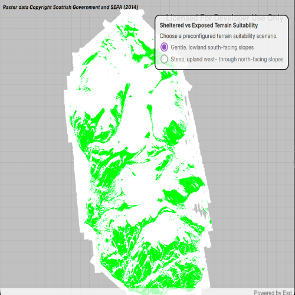

# Analyze terrain suitability from slope and aspect

Analyze terrain suitability from an elevation raster by deriving slope and aspect.

## Use case

Terrain suitability analysis narrows a larger elevation surface down to areas that match a specific set of conditions. Slope and aspect are derived from elevation datasets to show how steep the terrain is and which direction it faces. Those factors can determine whether an area is suitable for a given purpose, such as finding more sheltered terrain versus more exposed terrain.

## How to use the sample

When the sample opens, the map shows a preconfigured terrain suitability analysis for south-facing lowland slopes on the Isle of Arran, Scotland. The matching areas are rendered in green and the non-matching areas are rendered in white. Open the settings panel to switch to the second scenario, which highlights west- to north-facing upland slopes in purple.

## How it works

1. Create a blank `Map` with a spatial reference set to UTM 30N so the analysis runs in a conformal coordinate system.
2. Create a `ContinuousField` from the elevation raster and project it to the map spatial reference.
3. Create a `ContinuousFieldFunction` from the continuous field and derive `slope` and `aspect` functions.
4. Build `BooleanFieldFunction` masks for slope, aspect, elevation, and land-only areas using range checks and long-form boolean field methods.
5. Combine the masks with `logicalAnd` and `logicalOr` to build a final scenario mask.
6. Convert the final mask to a `DiscreteFieldFunction` and create a `FieldAnalysis` from it.
7. Apply a `ColormapRenderer` with white for non-matching areas and green or purple for matching areas.
8. Add the analyses to an `AnalysisOverlay` and toggle their visibility from the settings panel.

## Relevant API

- AnalysisOverlay
- BooleanFieldFunction
- Colormap
- ColormapRenderer
- ContinuousField
- ContinuousFieldFunction
- DiscreteFieldFunction
- FieldAnalysis
- Map
- MapQuickView
- SpatialReference

## About the data

The sample uses a [10m resolution digital terrain elevation raster of the Isle of Arran, Scotland](https://www.arcgis.com/home/item.html?id=aa97788593e34a32bcaae33947fdc271) from ArcGIS Online.

The data requires this attribution to be shown in the app display somewhere:

Raster data Copyright Scottish Government and SEPA (2014)

## Tags

aspect, elevation, field analysis, map algebra, raster, slope, spatial reference, terrain
