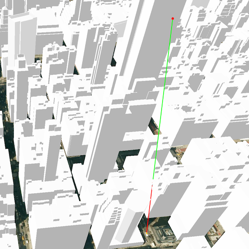

# Show exploratory line of sight between geoelements

Show an exploratory line of sight between two moving objects.

## Use case

An exploratory line of sight between `GeoElement`s (i.e. observer and target) will not remain constant whilst one or both are on the move.

An `ExploratoryGeoElementLineOfSight` is therefore useful in cases where visibility between two `GeoElement`s requires monitoring over a period of time in a partially obstructed field of view
(such as buildings in a city).

Note: This analysis is a form of "exploratory analysis", which means the results are calculated on the current scale of the data, and the results are generated very quickly but not persisted.

## How to use the sample

An exploratory line of sight will display between a point on the Empire State Building (observer) and a taxi (target).
The taxi will drive around a block and the exploratory line of sight should automatically update.
The taxi will be highlighted when it is visible. You can change the observer height with the slider to see how it affects the target's visibility.

## How it works

1. Instantiate an `AnalysisOverlay` and add it to the `SceneView`'s analysis overlays collection.
2. Instantiate a `ExploratoryGeoElementLineOfSight`, passing in observer and target `GeoElement`s (features or graphics). Add the exploratory line of sight to the analysis overlay's analyses collection.
3. To get the target visibility when it changes, react to the target visibility changing on the `ExploratoryGeoElementLineOfSight` instance.

## Relevant API

* AnalysisOverlay
* ExploratoryGeoElementLineOfSight
* ExploratoryLineOfSight.TargetVisibility

## Offline data

Link | Local Location
---------|-------|
|[Taxi CAD](https://www.arcgis.com/home/item.html?id=3af5cfec0fd24dac8d88aea679027cb9)|`<userhome>/ArcGIS/Runtime/Data/3D/dolmus\_3ds/dolmus.zip`|

## Tags

3D, exploratory line of sight, visibility, visibility analysis
