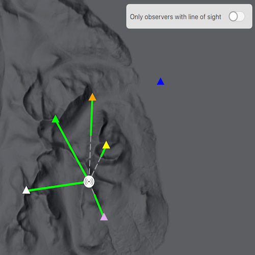

# Show line of sight analysis in map

Perform a line of sight analysis in a map view between fixed observer and target positions.

## Use case

Line of sight analysis determines whether a target can be seen from one or more observer locations based on elevation data. This can support planning workflows such as siting communication equipment, assessing observation coverage, or evaluating potential obstructions between known locations. In this sample, several predefined observer points are evaluated against a single fixed target to compare visibility outcomes side by side.

Note: This analysis is a form of "data-driven analysis", which means the analysis is calculated at the resolution of the data rather than the resolution of the display.

## How to use the sample

The sample loads with a map centered on the Isle of Arran, Scotland, and runs a line of sight analysis from multiple observer points (triangles) to a fixed target point (beacon icon) located at the highest point of the island. Solid green line segments represent visible portions of each line of sight result, and dashed gray segments represent not visible portions. Click an observer to see a callout that reports whether the target is visible and over what distance the line remains unobstructed. Use the switch to show only results where the target is visible from the observer.

## How it works

1. Create a `Map` and set it on a `MapQuickView`.
2. Create `GraphicsOverlay` instances and add the target and observer graphics with appropriate symbols, along with a separate results overlay for the line of sight output.
3. Create a `ContinuousField` from a raster file containing elevation data.
4. Create `LineOfSightPosition` objects from the target and observer `Point`s using `HeightOrigin::Relative`.
5. Configure `LineOfSightParameters` with `ObserverTargetPairs` using the observer and target line of sight positions.
6. Create a `LineOfSightFunction` from the continuous field and line of sight parameters.
7. Evaluate the function to get `LineOfSight` results.
8. Create `Graphic` objects from each result using the geometry of `visibleLine` or `notVisibleLine` and an appropriate line symbol.
9. Use `LineOfSight::targetVisibility` to determine whether an observer position has a direct line of sight to the target.
10. Get the length of the visible line result with `GeometryEngine::lengthGeodetic` to report the callout result.

## Relevant API

* ContinuousField
* GeometryEngine
* GraphicsOverlay
* LineOfSight
* LineOfSightFunction
* LineOfSightParameters
* LineOfSightPosition
* ObserverTargetPairs

## Offline data

To set up the sample's offline data, see the [Use offline data in the samples](https://github.com/Esri/arcgis-runtime-samples-qt#use-offline-data-in-the-samples) section of the Qt Samples repository overview.

Link | Local Location
---------|-------|
|[Arran elevation raster](https://www.arcgis.com/home/item.html?id=aa97788593e34a32bcaae33947fdc271)| `<userhome>`/ArcGIS/Runtime/Data/raster/arran.tif |

## About the data

The sample uses a [10m resolution digital terrain elevation raster of the Isle of Arran, Scotland](https://www.arcgis.com/home/item.html?id=aa97788593e34a32bcaae33947fdc271)
(Raster data Copyright Scottish Government and SEPA (2014)).

## Tags

analysis, elevation, line of sight, map view, spatial analysis, terrain, visibility

