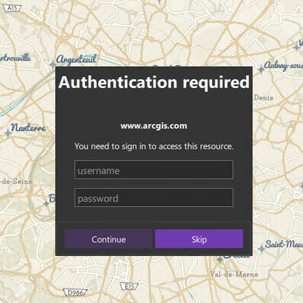

# Token authentication

Access a web map that is secured with ArcGIS token-based authentication.

## Use case

Allows you to access a secure service with the convenience and security of ArcGIS token-based authentication. For example, rather than providing a user name and password every time you want to access a secure service, you only provide those creditials initially to obtain a token which then can be used to access secured resources.

## How to use the sample

Once you launch the app, you will be challenged for an ArcGIS Online login to view the protected map service. Enter a user name and password for an ArcGIS Online named user account (such as your ArcGIS for Developers account). If you authenticate successfully, the protected map service will display in the map.

## How it works

1. Declare an `Authenticator` in your QML.
2. Create a `Portal`.
3. Create a `PortalItem` for the protected web map using the `Portal` and Item ID of the protected map service.
4. Create a `Map` using the `PortalItem`.
5. Set the map to display in the `MapView`.
6. This will trigger an `ArcGISAuthenticationChallenge`, which will be handled by the `Authenticator`.
7. An `ArcGISCredential` will be created with the username and password, and if successful, will display the service.

## Relevant API

* Authenticator
* Authentication::ArcGISCredential
* Authentication::AuthenticationManager
* PortalItem

## About the data

The [Traffic web map](https://arcgisruntime.maps.arcgis.com/home/item.html?id=e5039444ef3c48b8a8fdc9227f9be7c1) uses public layers as well as the world traffic (premium content) layer. The world traffic service presents historical and near real-time traffic information for different regions in the world. The data is updated every 5 minutes. This map service requires an ArcGIS Online organizational subscription.

## Additional information

Please note: the username and password are case sensitive for token-based authentication. If the user doesn't have permission to access all the content within the portal item, partial or no content will be returned.

## Tags

authentication, cloud, portal, remember, security
