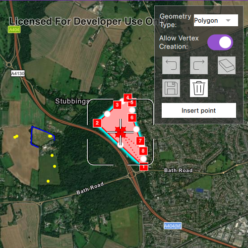

# Edit geometries with programmatic reticle tool

Use the Programmatic Reticle Tool to edit and create geometries with programmatic operations to facilitate customized workflows such as those using buttons rather than tap interactions.

## Use case

A field worker can use a button driven workflow to mark important features on a map. They can digitize features like sample or observation locations, fences, pipelines, and building footprints using point, multipoint, polyline, and polygon geometries. To create and edit geometries, workers can use a vertex-based reticle tool to specify vertex locations by panning the map to position the reticle over a feature of interest. Using a button-driven workflow they can then place new vertices or pick up, move and drop existing vertices.

## How to use the sample

To create a new geometry, select the geometry type you want to create (i.e. points, multipoints, polyline, or polygon) in the settings view. Press the button to start the geometry editor, pan the map to position the reticle then press the button to place a vertex. To edit an existing geometry, tap the geometry to be edited in the map and perform edits by positioning the reticle over a vertex and pressing the button to pick it up. The vertex can be moved by panning the map and dropped in a new position by pressing the button again.

Vertices can be selected and the viewpoint can be updated to their position by tapping them.

Vertex creation can be disabled using the switch in the settings view. When this switch is toggled off new vertex creation is prevented, existing vertices can be picked up and moved, but mid-vertices cannot be selected or picked up and will not grow when hovered. The feedback vertex and feedback lines under the reticle will also no longer be visible.

Use the buttons in the settings view to undo or redo changes made to the geometry and the cancel and done buttons to discard and save changes, respectively.

## How it works

1. Create a `GeometryEditor` and set it to the `MapQuickView` using `MapQuickView::setGeometryEditor()`.
2. Start the geometry editor using `GeometryEditor::start(GeometryType)` to create a new geometry or `GeometryEditor::start(Geometry)` to edit an existing geometry.
    * If using the geometry editor to edit an existing geometry, the geometry must be retrieved from the graphics overlay being used to visualize the geometry prior to calling the start method. To do this:
        * Use `MapQuickView::identifyGraphicsOverlayAsync(...)` to identify graphics at the location of a tap.
        * Find the desired graphic in the result list.
        * Access the geometry associated with the `Graphic` using `Graphic::geometry()` - this will be used in the `GeometryEditor::start(Geometry)` method.
3. Create a `ProgrammaticReticleTool` and set the `GeometryEditor.setTool`.
4. Add event handlers to listen to `GeometryEditor::hoveredElementChanged` and `GeometryEditor::pickedUpElementChanged` signals.
    * These signals can be used to determine the effect a button press will have and set the button text accordingly.
5. Listen to tap events when the geometry editor is active to select and navigate to tapped vertices and mid-vertices.
    * To retrieve the tapped element and update the viewpoint:
        * Use `MapQuickView::identifyGeometryEditorResultAsync(...)` to identify geometry editor elements at the location of the tap.
        * Find the desired element in the result list.
        * Depending on whether the element is a `GeometryEditorVertex` or `GeometryEditorMidVertex`, use `GeometryEditor::selectVertex(...)` or `GeometryEditor::selectMidVertex(...)` to select it.
        * Update the viewpoint using `MapQuickView::setViewpointCenterAsync(...)`.
6. Enable and disable the vertex creation preview using `ProgrammaticReticleTool::setVertexCreationPreviewEnabled()`.
    * To prevent mid-vertex growth when hovered use `ProgrammaticReticleTool::style()->growEffect()->setApplyToMidVertices()`.
7. Check to see if undo and redo are possible during an editing session using `GeometryEditor::canUndo()` and `GeometryEditor::canRedo()`. If possible, use `GeometryEditor::undo()` and `GeometryEditor::redo()`.
    * A picked up element can be returned to its previous position using `GeometryEditor::cancelCurrentAction()`. This can be useful to undo a pick up without undoing any change to the geometry. Use the `GeometryEditor::pickedUpElement()` property to check for a picked up element.
8. Check whether the currently selected `GeometryEditorElement` can be deleted (`GeometryEditor::selectedElement()->canDelete()`). If the element can be deleted, delete using `GeometryEditor::deleteSelectedElement()`.
9. Call `GeometryEditor::stop()` to finish the editing session and store the `Graphic`. The geometry editor does not automatically handle the visualization of a geometry output from an editing session. This must be done manually by propagating the geometry returned into a `Graphic` added to a `GraphicsOverlay`.
    * To create a new `Graphic` in the `GraphicsOverlay`:
        * Using `Graphic(Geometry)`, create a new graphic with the geometry returned by the `GeometryEditor::stop()` method.
        * Append the `Graphic` to the `GraphicsOverlay` using `GraphicsOverlay::graphics()->append(graphic)`.
    * To update the geometry underlying an existing `Graphic` in the `GraphicsOverlay`:
        * Replace the existing `Graphic`'s geometry using `Graphic::setGeometry()` with the geometry returned by the `GeometryEditor::stop()` method.

## Relevant API

* Geometry
* GeometryEditor
* Graphic
* GraphicsOverlay
* MapView
* ProgrammaticReticleTool

## Additional information

The sample demonstrates a number of workflows which can be altered depending on desired app functionality:

* picking up a hovered element combines selection and pick up, this can be separated into two steps to require selection before pick up.

* tapping a vertex or mid-vertex selects it and updates the viewpoint to its position. This could be changed to not update the viewpoint or also pick up the element.

With the hovered and picked up element changed events and the programmatic APIs on the `ProgrammaticReticleTool` a broad range of editing experiences can be implemented.

## Tags

draw, edit, freehand, geometry editor, programmatic, reticle, sketch, vertex
